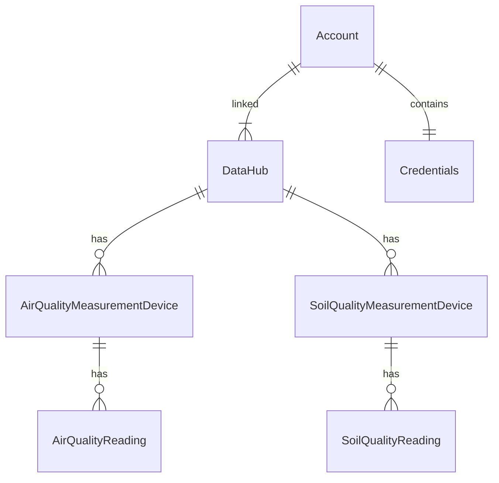

#Overview
This is ASP.NET Core application for the storage/processing/retrieval of air and soil quality data in a MSSQL Server database.

#Entity Relationship


#Versions
.Net - 8

#Running Instructions
1. Create .env file in solution root with following variables:
  - SQL_SERVER_SA_PASSWORD - SA password for sql server
2. In a terminal run the following ```.\StartContainers.ps``` with the following optional parameters:
  - ```-Rebuild``` - To rebuild the images for all containers, this should be done after making any code changes
  - ```-IncludeWebApp``` - This creates and starts a container for the web application, run this when not running the application directly from visual studio.
3. Open a browser and go to http://localhost:**{Port Number}**/swagger/index.html